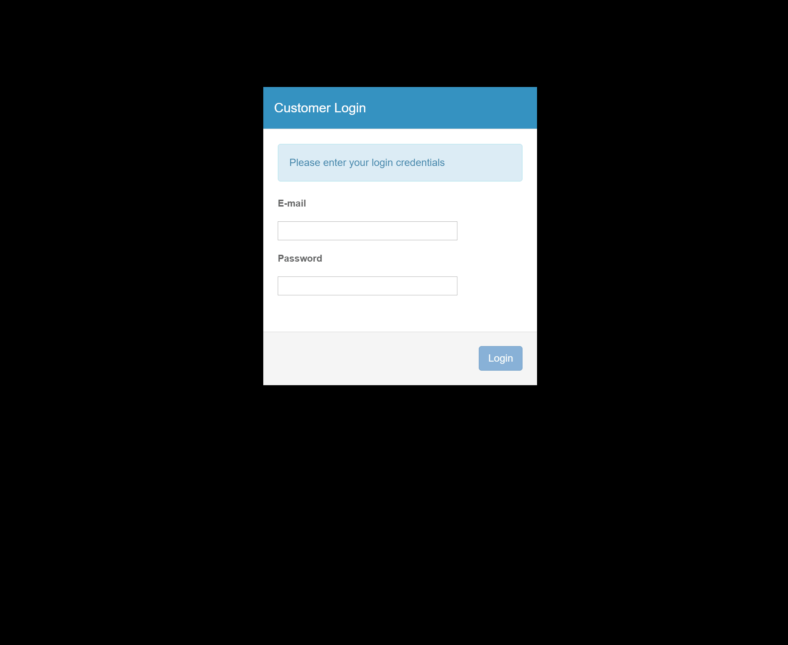

# demo-acme

## An AngularJS 1.2 demo from 2014

I did this waaaay back in 2014, then published to Github
in Jan 2015. After so many years, it definitely did not load. So I tweaked the
bower & npm dependencies to enforce the old versions. Tech used:

- AngularJS
- RequireJS
- AmplifyJS
- Bootstrap
- Express
- Lodash
- Moment

## Demo Video

There are a few bugs in the initial data display and a couple errors while clicking
through, but not bad for a 4 year old app! I sooo hated RequireJS... and couldn't
wait to dump it. It's funny that I used to use Bower. :smile:

